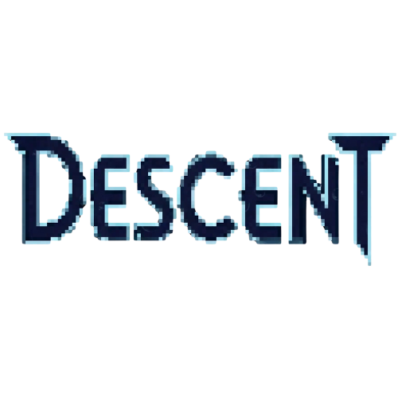

# DESCENT : ABYSSAL PLUMMET

## Harrison Traue




### Gameplay and elements
-------------------------    

https://github.com/user-attachments/assets/ae580dbe-157b-4bfb-b74e-825bb6fc0b8c


## What I have delivered and what went well :star:

- A playable character can move and jump
- An obstacle with collider, which is able to kill the player
- A respawn mechanic 
- Multiple Functional particle systems
- Implementation of lights, manipulating the shadows
- A following camera with delayed follow speed  
- 1 Short level design
- A title screen animation, playing into the title screen, which proceeds into the main menu screen
- Sound tracks to main menu and Title screen sequence 
- A functional main menu UI screen, with Options, Quit and play.
- Implemented an how to play UI before Level 2 begins. Click any key to begin level 2
- A pause panel UI screen (LEVEL 2)
- Working resume button (LEVEL 2)
- A functional restart feature to restart the level again (LEVEL 2)
- In game real time score UI (LEVEL 2)
- Display of in game combo UI (LEVEL 2)
- Animated background gifs (LEVEL 2)
- Working Rhythm beatscroller - Function : Allows the notes to fall (LEVEL 2)
- Hit detection of the Turtle (Arrows) prefabs (LEVEL 2)
- Hidden Cursor while playing, and pausing re-enables it (LEVEL 2)
- Next level sequence if score threashold reached (LEVEL 2)


**I am really proud of how my game turned out, from the basic 2d platformer to visually appealing rhythm game. I feel like I have excelled in creating a vision on how I wanted my game to look - Aquatic. I managed to build a solid core game loop, successfully implementing the BeatScroller for note movement and a stacked GameManager.cs to handle complex state transitions like pausing and game over. I was estactic when the score system worked, holding multiple score threshholds. I focused on polishing the game by adding player friendly features pause panel, resume and restart buttons. I also included combo text and background music to further enchance visual feedback. Most of my time was focused on developing the rhythm game (Or level 2) so level 1 had minimal code, and mostly focused on visual elements. The simple title scene sequence was something I was also proud of.**


## What I had hoped to deliver and what didn't go well :x:

- A working Combo system (Increasing score with higher combos) (LEVEL 2)
- Expansion of Level 1 - Pause panel, restart button, Full level design, Nice visual elements, Player animation etc
- Development of the ending levels - Google snake like game, and round based boss battle minigame
- Addition of settings in the options menu - Adjustable sound, screen size, etc
- A guide npc which would swim past your screen, giving basic game tips
- An actual storyline to the game, animated cutscene by hand in unity using the animator
- Synced sound for the beginning cutscene
- Paralex background for Level 1

**While the core aesthetic and structure of my rhythm game was nearly complete. My most critical failure was in inability to fix the Combo and score multiplier system, which made the game feel less rewarding in a way. Content in level 1 is lacking. And it fails to introduce my actual game and its storyline. I also had some critical errors with the intial setup of the [beatscroller](https://github.com/TempeHS/2025CT_Harrison.T_name/blob/main/Assets/Scripts/BeatScroller.cs) code, as the manual method of alligning notes was too much of a problem.** 


### About my project

## General

Descent - Abyssal Plummet, Is the name of my game. The aim of this game is to progress through deep sea themed levels completing a variety of Minigames that I had hoped to design, with the finale of the game being a deep sea brawl against a fierce crab. Plot wise, It needs work however while developing I had mostly drifted off course and did whatever I thought was fun to do, or whatever I invested my thoughts in to.

## Objective and Idea

Descent : Expedtion. To play simple hold the A & D keys to move either left or right until you reach the end!.  This first level is a simple 2D platformer consisting of obstacles, atmosphere and low gravity...   

Descent : Jellyfish drop. To play simply tap the falling jellyfish precisely as they align with the turtles at the bottom of the screen. As the music plays, jellyfish will descend, and your goal is to tap each lane right when its jellyfish perfectly overlaps its corresponding target. The game ends once the music has stopped. To succeed, listen to the music as its your guide.  This is the 2nd level of the adventurous dive. Developement is inspired by multiple rhythm games already existing on the internet. Popular games include, 'Rhythm plus', 'Friday Night Funkin', 'Osu Mania' and quite the handful more. Gameplay is practically identical, however I have implemented a few of my own twists to match my overall theme. 


### Controls / Keybinds ⌨️

Descent : Expedition           
-------------------------      
| Function  | Keybind  |        
| ---       | ---      |        
| Walk Right| ➡️ / D  |         
| Walk Left | ⬅️ / A  |        
| Jump      | SpaceBar |         


Descent : Jellyfish Drop
---------------------------
| Function |  Keybind  |
| -------------------- |-------------------|
| Left / Yellow Turtle | D / ⬅️            |
| Up / Blue Turtle     | F / ⬆️            |
| Down / Green Turtle  | J / ⬇️            |
| Right / Red Turtle   | K / ➡️            | 
| Pause Panel          | Escape key        |


### Executing program

* How to run the program
* Step-by-step bullets
```
code blocks for commands
```


## Asset Showcase :open_file_folder: 
-------------------------    

[View all Assets](https://github.com/TempeHS/2025CT_Harrison.T_name/tree/main/Assets/Sprites)

Every 2D element **except** for the smoke cloud and main menu background has been produced by the *Artist* (Me)

## Tutorials


[Rhythm game tutorial Part 1](https://www.youtube.com/watch?v=cZzf1FQQFA0&list=PLLPYMaP0tgFKZj5VG82316B63eet0Pvsv&index=1) 

[Rhythm game tutorial Part 2](https://www.youtube.com/watch?v=PMfhS-kEvc0&list=PLLPYMaP0tgFKZj5VG82316B63eet0Pvsv&index=2)

[Rhythm game tutorial Part 3](https://www.youtube.com/watch?v=dV9rdTlMHxs&list=PLLPYMaP0tgFKZj5VG82316B63eet0Pvsv&index=3)

[Rhythm game tutorial Part 4](https://www.youtube.com/watch?v=dV9rdTlMHxs&list=PLLPYMaP0tgFKZj5VG82316B63eet0Pvsv&index=4)

[Rhythm game tutorial Part 5](https://www.youtube.com/watch?v=Usuh7WUAPbg&list=PLLPYMaP0tgFKZj5VG82316B63eet0Pvsv&index=5)

[2D LEVEL DESIGN with Tile Palette](https://www.youtube.com/watch?v=vN4H7N_k3eg&list=PLf6aEENFZ4Fv0ifncKE3T05qrI450U_aD&index=3)

[2D SMOOTH CAMERA FOLLOW Tutorial](https://www.youtube.com/watch?v=QfLhSzeZaoA&list=PLf6aEENFZ4Fv0ifncKE3T05qrI450U_aD&index=4)

[2D Player RESPAWN Tutorial](https://www.youtube.com/watch?v=odStG_LfPMQ&list=PLf6aEENFZ4Fv0ifncKE3T05qrI450U_aD&index=10)

[MAIN MENU Quickly! | Unity UI Tutorial ](https://www.youtube.com/watch?v=DX7HyN7oJjE&list=PLf6aEENFZ4Fv0ifncKE3T05qrI450U_aD&index=23)

[2D Player Movement In Unity](https://www.youtube.com/watch?v=K1xZ-rycYY8)
[How to Import a 2D Character Sprite Sheet and Use in a GameObject in Unity](https://www.youtube.com/watch?v=FXXc0hTWIMs)

[Idle, Run and Jump Animations - Platformer Unity 2D](https://www.youtube.com/watch?v=Sg_w8hIbp4Y&t=315s)

[How To Make An Atmospheric 2D Game](https://www.youtube.com/watch?v=7qcKMUioPI0)

[How To Make An Atmospheric 2D Game (Pt2)](https://www.youtube.com/watch?v=S10eaYrNnYM)

[]()

[]()
[]()
[]()
[]()
[]()
[]()


I have utilzed ai in assisting me throughout this project. I used Co-Pilot to accelerate the learning curve for complex unity systems. The AI acted as a mentor, assisting me for the Combo system, the Pause State and some visual systems. I have made sure to use Ai as a tool to Strengthen my understanding of Unity and C# code, instead of it being a tool to replace myself.


# Other


## Authors :ledger:

🎨 Artist - Harrison Traue
💻 Developer - Harrison Traue

ex. Mr Jones
ex. [@benpaddlejones](https://github.com/benpaddlejones)

## License :credit_card:

This project is licensed under the [HARRISON TRAUE] License - see the LICENSE.md file for details

